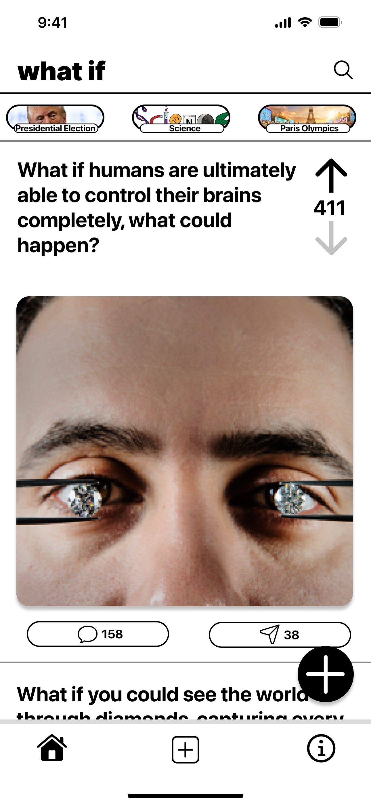
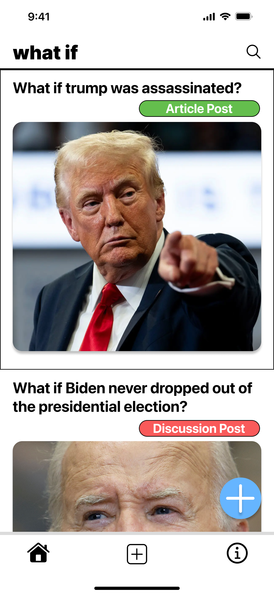
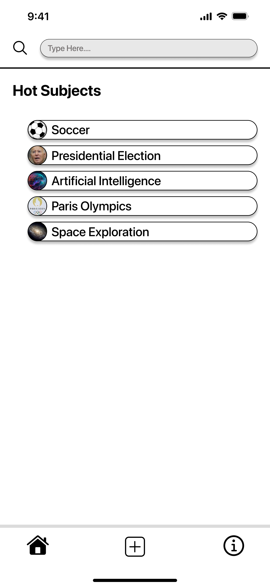

# what if

# **Embark on a journey of curiousity and creativity**


**note: This is a simple web application for now. There will be further refinement, and the mobile version with SwiftUI has not been implemented or updated since august of 2024.**

DEPLOYED-URL: [WHAT IF](https://whatif.onrender.com/)
Figma Link for phone design. [FIGMA](https://www.figma.com/design/G6O3N00KQlUa1w6VNPC03l/What-if?node-id=0-1&t=CdRa0vTsUsB1f2cJ-1)

what if is a web application designed for users to explore hypothetical scenarios and share their thoughts. Users can create posts starting with "What if..." and engage with others' posts. 

I've been interested by the idea of exploring hypothetical scenarios and wanted to create a platform where people can share and discuss their "What if" ideas, ranging from wide variety of topics, including politics, science, and technology. Whether it's a simple thought or a detailed exploration, realitic or fictional, users can express their creativity and engage with others.


## Features

- **User Interaction**: Users can create posts starting with "What if..." and share their thoughts. Other users can view and interact with the latest posts by commenting and in the future, like and share the posts. 


## Technologies Used

- **Frontend**: 
  - React
  - Vite
  - React Router for navigation
  - Axios for API calls

- **Backend**: 
  - Node.js
  - Express
  - MongoDB for data storage

- **API**:
  - Unsplash API for images

## Getting Started

To get started with WHAT IF, follow these steps:

1. Clone the repository:
   ```
   git clone <repository-url>
   ```

2. Navigate to the client directory and install dependencies:
   ```
   cd client
   npm install
   ```

3. Navigate to the server directory and install dependencies:
   ```
   cd server
   npm install
   ```

4. Set up your environment variables in a `.env` file in the server directory. Needed variables:
   ```
   PORT
   MONGODB_URI
   UNSPLASH_ACCESS_KEY
   ```

5. Start the backend server:
   ```
   npm run dev
   ```

6. In a new terminal, start the frontend:
   ```
   cd client
   npm run dev
   ```


## Looking Forward

I have several plans for future improvements:

- Improve the design with animations and improved aesthetics. I'm having a hard time implementing this app in the web. While it's intuitive to use this app on the phone, it is tricky to lay out the components in the web. 
- Add features for users to comment on and like posts.
- Enhance the design with animations and improved aesthetics.
- Introduce a feature to categorize posts based on topics or themes.

